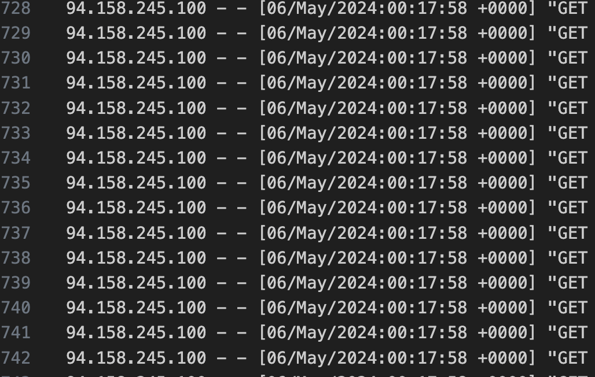
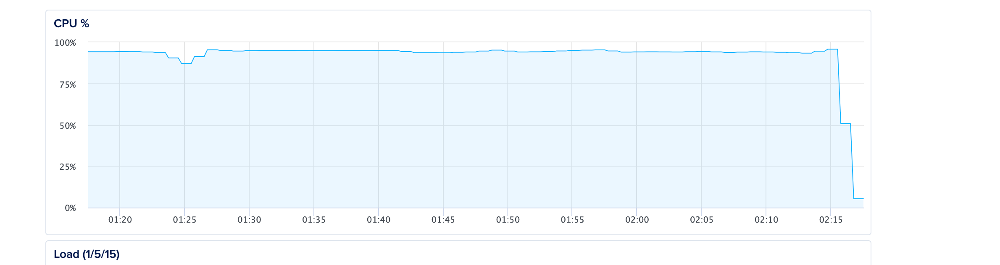

# Issue #15: DDoS Protection with Nginx, Docker-in-Docker and Privacy Concerns

Salam 👋

I have been busy the past week to plan for the revival of my YouTube Channel again with new content and new plans. So
stay tuned 😉

I am sure some of you have read something interesting this week, maybe you can send it over to me and I will include it
in the next issue.

If you also live in Germany and plan to start your own business, I am running a survey to understand the challenges that
migrants face when starting a business in Germany.
If you are interested, please fill out this survey:

[https://forms.gle/1tUp8mnSDDXR9jtt6](https://forms.gle/1tUp8mnSDDXR9jtt6)

## This week’s News

Let’s try a section about some interesting tech news

- [Telegram messaging app CEO Durov arrested in France](https://www.reuters.com/world/europe/telegram-messaging-app-ceo-pavel-durov-arrested-france-tf1-tv-says-2024-08-24/)
- [A tech revolution in rural India: Training poor women in STEM](https://www.aljazeera.com/economy/2024/8/31/a-tech-revolution-in-rural-india-training-poor-women-in-stem)
- [UK: Big Tech platforms play an active role in fuelling racist violence](https://www.amnesty.org/en/latest/news/2024/08/uk-big-tech-platforms-play-an-active-role-in-fuelling-racist-violence/)
- [Skilled professionals leaving Germany for other English speaking countries](https://www.infomigrants.net/en/post/58508/skilled-professionals-leaving-germany-for-other-english-speaking-countries)
- [Latvia’s emerging tech ecosystem](https://tech.eu/2024/09/02/latvias-emerging-tech-ecosystem/)
- [Meta’s Open Source LLM Model Llama 3.1 is released](https://ai.meta.com/blog/meta-llama-3-1/)

## Technical Summaries

### Quick DDoS Protection

One of my client's website got under a DDoS attack and I needed to act quickly. But first I needed to confirm it was a
DDoS attack and not something else:

- At first, I noticed there was a spike in CPU usage on the hosting Dashboard which could indicate many things not
  necessarily a DDoS attack but maybe a stuck request, an infinite loop or a bug in one of WordPress plugins or even an
  issue with the MySQL engine.

- I logged into the server an ran the command `ps -aux` to check all currently running processes and see which one
  consumes the highest CPU usage and it turns out it was the PHP Engine `php-fpm`

- I checked the logs and found out there was a massive number of requests which just confirmed it's a DDoS attack.



That's where it was confirmed it was a DDoS attack and needed to stop it in few easy steps:

- First, I updated Nginx configs with a directive to limit the number of open connections per ip to only 10 connections

```nginx
limit_conn_zone $binary_remote_addr zone=addr:10m;

server {
    limit_conn addr 10;
}
```

- I then added a deny directive to the problematic IP address

```nginx
http {
    deny 94.158.245.100
}
```

Voilà! the CPU usage just dropped to almost normal usage thanks to Nginx's high throughput to just deny a high
amount of requests easily. Of course a better option is to use CloudFlare but when under attack, one must act quickly to
keep the website afloat compared to just shutting down the server!



Read more:

- [How to prevent DDoS Attacks](https://www.cloudflare.com/learning/ddos/how-to-prevent-ddos-attacks/)
- [Mitigating DDoS Attacks with NGINX and NGINX Plus](https://www.nginx.com/blog/mitigating-ddos-attacks-with-nginx-and-nginx-plus/)
- [NGINX rate limiting](https://www.solo.io/topics/nginx/nginx-rate-limiting/)

### Using Docker-in-Docker

Using Docker-in-Docker or DinD is useful for docker development or when you want to have different isolated environments
for a complex application like CI for example. Though I needed to use this approach to run a WordPress Multi-tenant
architecture and it worked nicely.

There are two ways to run a DinD:

- Run a Docker container inside another Docker container and it will have its own Docker daemon and spawned containers
- Run a Docker container and share the host Docker socket with the container so that it runs containers on the host
  directly

I needed to use the second approach. The idea is to share the host socket `/var/run/docker.sock:/var/run/docker.sock`
with the Docker container.

So an example command will be like this

```sh
docker run -it -v /var/run/docker.sock:/var/run/docker.sock docker:26-cli docker run nginx
```

This will run a nginx container from a docker container all shared on the same docker host

Read more:

- [Using Docker-in-Docker for your CI or testing environment? Think twice](https://jpetazzo.github.io/2015/09/03/do-not-use-docker-in-docker-for-ci/)

## Videos of the Week

### Our Privacy Is In Serious Danger By The Government Right Now...

@[youtube](https://www.youtube.com/watch?v=SW8V_pZxmq4)

### Is Google Training AI on YouTube Videos?

@[youtube](https://www.youtube.com/watch?v=JiMXb2NkAxQ)
