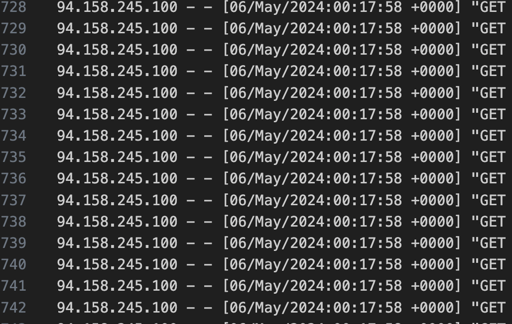
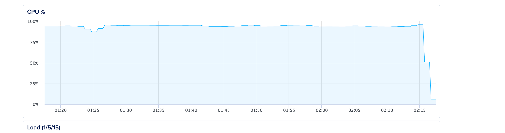

# Quick DDoS Protection

One of my client's website got under a DDoS attack and I needed to act quickly. But first I needed to confirm it was a
DDoS attack and not something else:

- At first, I noticed there was a spike in CPU usage on the hosting Dashboard which could indicate many things not
  necessarily a DDoS attack but maybe a stuck request, an infinite loop or a bug in one of WordPress plugins or even an
  issue with the MySQL engine.

- I logged into the server an ran the command `ps -aux` to check all currently running processes and see which one
  consumes the highest CPU usage and it turns out it was the PHP Engine `php-fpm`

- I checked the logs and found out there was a massive number of requests which just confirmed it's a DDoS attack.



That's where it was confirmed it was a DDoS attack and needed to stop it in few easy steps:

- First, I updated Nginx configs with a directive to limit the number of open connections per ip to only 10 connections

```nginx
limit_conn_zone $binary_remote_addr zone=addr:10m;

server {
    limit_conn addr 10;
}
```

- I then added a deny directive to the problematic IP address

```nginx
http {
    deny 94.158.245.100
}
```

Voilà! the CPU usage just dropped to almost normal usage thanks to Nginx's high throughput to just deny a high amount of
requests easily. Of course a better option is to use CloudFlare but when under attack, one must act quickly to keep the
website afloat compared to just shutting down the server!



Read more:

- [How to prevent DDoS Attacks](https://www.cloudflare.com/learning/ddos/how-to-prevent-ddos-attacks/)
- [Mitigating DDoS Attacks with NGINX and NGINX Plus](https://www.nginx.com/blog/mitigating-ddos-attacks-with-nginx-and-nginx-plus/)
- [NGINX rate limiting](https://www.solo.io/topics/nginx/nginx-rate-limiting/)
